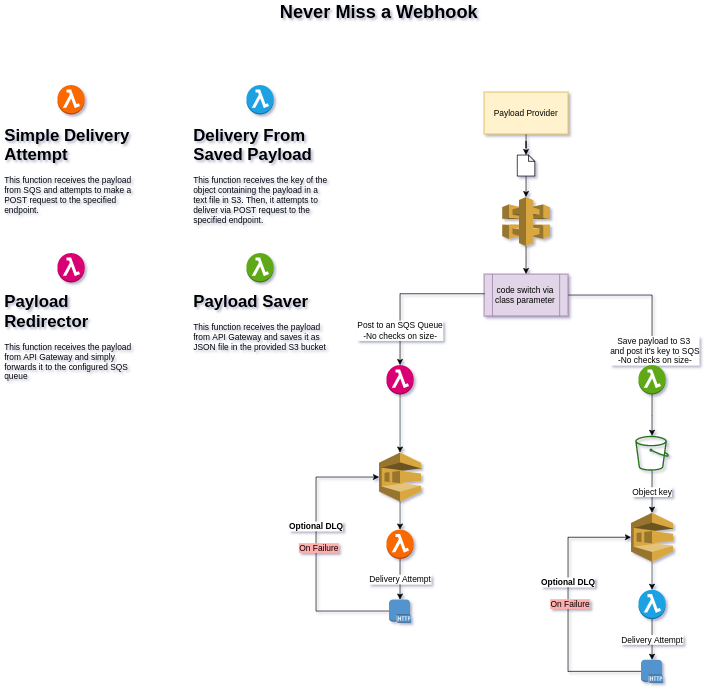

# Never Miss A Webhook

Never Miss A Webhook is a Pulumi program aimed at removing the burden of configuring a cloud structure in aws 
responsible for taking care of the notifications you don't want to lose.  
With Pulumi the burden is even lower than most of other implementations (like configuring everything by hand or by 
a complicated d language) because you can code the cloud infrastructure in many actual programming 
languages.  
In our case, this project is fully written in Typescript so, if there's anything you want to change or customise in it,
you are ready to go.  

## Usage


Considering the graphical explanation above, that translates into code like this:  
```typescript

```

# Environment configuration

1) Set your aws region with: 
$ pulumi config set aws:region <region>


https://medium.com/lego-engineering/functionless-s3-integration-inside-a-serverless-casserole-part-1-b300085eea78
https://chipperci.com/news/never-miss-a-webhook
https://medium.com/@adamboazbecker/guide-to-connecting-aws-lambda-to-s3-with-pulumi-15393df8bac7

Error creating S3 bucket: AuthorizationHeaderMalformed: The authorization header is malformed; the region 'us-east-1' is wrong; expecting 'us-west-2'
